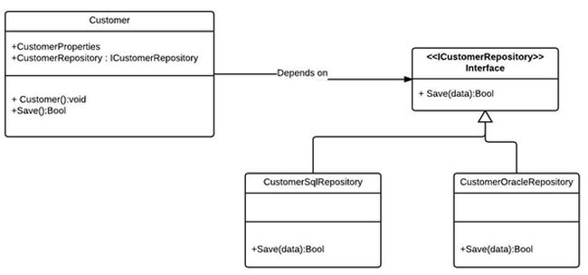
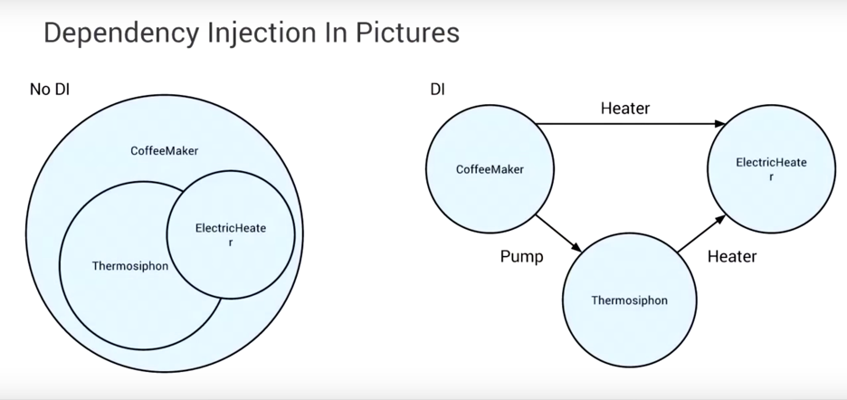

# Dependency injection
Jan Stoltman

---

## SOLID

* Single Responsibility principle
* Open/closed principle
* Liskov substitution principle
* Interface segregation principle
* Dependency inversion principle

---

## Depenedency inversion

1. High-level modules should not depend on low-level modules. Both shoud depend on abstractions.
2. Abstractions should not depend on details. Details should depend on abstractions.

---

#### High-level -> Abstraction <- Low-level 



---

```java
public class BackEndDeveloper {
    public void writeJava() {
    }
}


public class FrontEndDeveloper {
    public void writeJavascript() {
    }
}
```

---

```java
public class Project {
    private BackEndDeveloper backEndDeveloper =
		new BackEndDeveloper();
    private FrontEndDeveloper frontEndDeveloper = 
		new FrontEndDeveloper();
    public void implement() {
        backEndDeveloper.writeJava();
        frontEndDeveloper.writeJavascript();
    }
}
```

---

```java
public interface Developer {
    void develop();
}
```

---

```java
public class BackEndDeveloper implements Developer {
    @Override
    public void develop() {
        writeJava();
    }
}

public class FrontEndDeveloper implements Developer {
    @Override
    public void develop() {
        writeJavascript();
    } 
}
```

---

```java
public class Project {
    private List<Developer> developers;

    public Project(List<Developer> developers) {
        this.developers = developers;
    }
    public void implement() {
        developers.forEach(d->d.develop());
    }
}
```

---

## Dependency inversion implementation

* Plugin pattern
* Service locator pattern
* Dependency injection

---

## Dependency injection

A technique whereby one object supplies the dependencies of another object. 
Passing the object (serivce) to the client, rather than allowing a client to build or find the serice, is the fundamental requirement of the pattern.

---

## What

> Make the creation of objects on which a class depends someone else's problem.


---

## Insted of

```java
public SomeClass() {
    myObject = Factory.getObject();
}
```

---

## Do this

```java
public SomeClass (MyClass myObject) {
    this.myObject = myObject;
}
```

---

```java
public class Example { 
  private DatabaseThingie myDatabase; 

  public Example() {
    myDatabase = new DatabaseThingie(); 
  } //Wrong!

  public Example(DatabaseThingie useThisDatabaseInstead) { 
    myDatabase = useThisDatabaseInstead; 
  } //Right!

  public void DoStuff() {  
    myDatabase.GetData(); 
  } 
}
```

---

## Thermosiphon



---

## How

* Constructor injection
* Field injection [*Considered harmful*]
* Method injection

---

## Why

* Tests
* Separation of concerns

---

## Frameworks

* Android: Dagger2, Koin
* Java: JSR330, SpringDI, Guice
* Python: snake-guice
---

> Developers that need dependency injection justified to them should rethink their choice of career. -- Random Redditor

---

## Sources
* https://martinfowler.com/articles/injection.html
* https://www.jamesshore.com/Blog/Dependency-Injection-Demystified.html
* https://stackoverflow.com/questions/130794/what-is-dependency-injection
* https://www.vojtechruzicka.com/field-dependency-injection-considered-harmful/
---

## The end 
